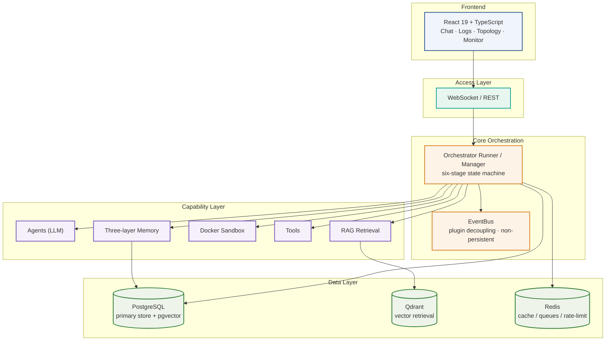
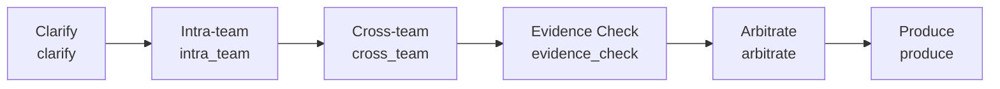

# ⚖️ Conclave

<p align="center">

**Multi-Agent Structured Decision Engine · Let AI deliver high-quality, traceable decisions through a "closed-door meeting"**

</p>

<p align="center">

**This repository is the open-source simplified edition (Community Edition) of the private repository [Conclave-internal](https://github.com/QAQupupup/Conclave-internal)**

</p>

<p align="center">

[简体中文](README.md) · English

</p>

<p align="center">

<a href="https://github.com/QAQupupup/Conclave/actions"></a>
<a href="https://github.com/QAQupupup/Conclave/blob/main/LICENSE"></a>
<a href="https://github.com/QAQupupup/Conclave/stargazers"></a>
<a href="https://github.com/QAQupupup/Conclave/issues"></a>
<a href="https://github.com/QAQupupup/Conclave/commits/main"></a>

</p>

> The badges below are clickable and link to the official repository or website of each component.

<p align="center">

<a href="https://www.python.org/"></a>
<a href="https://fastapi.tiangolo.com/"></a>
<a href="https://www.postgresql.org/"></a>
<a href="https://github.com/pgvector/pgvector"></a>
<a href="https://redis.io/"></a>
<a href="https://qdrant.tech/"></a>
<a href="https://casbin.org/"></a>

</p>

<p align="center">

<a href="https://react.dev/"></a>
<a href="https://www.typescriptlang.org/"></a>
<a href="https://docs.docker.com/compose/"></a>
<a href="https://playwright.dev/"></a>

</p>

---

## What is this?

Instead of a single model answering in one pass, Conclave orchestrates a **team of AI agents** as a formal closed-door meeting: the moderator clarifies the topic, multiple roles debate from their own perspectives, every claim is checked against evidence, an arbitration stage resolves conflicts, and a concrete deliverable is produced.

The whole process is **process-driven, evidence-backed, and adjudicated**, resulting in more reliable and **traceable** decisions rather than a single opaque "black-box" answer.

---

## Core Features

| Capability | Description |
|---|---|
| 🗂 **Six-stage pipeline** | clarify → intra-team → cross-team → evidence-check → arbitrate → produce, with quality gates and automatic fallback |
| 👥 **7 built-in roles** | product, engineering, security, UX, data, market, moderator — each with its own perspective, risk appetite, and evidence preference |
| 🧩 **Dynamic borrowing** | the moderator can request extra expert roles based on topic complexity |
| 🛡 **Evidence honesty** | every claim is tagged with its source (document / web / common knowledge / assumption); unsupported claims honestly downgrade confidence — never fabricated citations |
| 🎯 **Five-layer determinism** | parameter constraints, conclusion locking, drift checks, full-chain tracing, and degradation fallback |
| 🐳 **Docker sandbox** | code runs safely in isolated sibling containers, deployable to local or remote hosts |
| 🌐 **Web search** | agents actively search via Playwright to back up their claims |
| 🏢 **Enterprise-ready** | multi-tenant isolation, JWT + HttpOnly Cookie auth, Casbin RBAC, audit logs |
| 📊 **Observability** | real-time log panel, topology view, token & cost monitoring, full-chain LLM call tracing |

---

## Architecture Overview



> The name Conclave refers to a closed-door meeting: an AI collaboration session with process, evidence, adjudication, and a concrete deliverable.

## Six-stage Decision Flow



Each stage has an independent quality gate: if the result fails to meet the bar, it triggers automatic rollback or fallback rather than silently failing.

---

## Built With · Tech Stack

> The badge wall gives instant recognition; this table explains what each technology does. Logos are clickable and link to official addresses.

<p align="center">
<table align="center">
<tr>
  <td align="center" width="130"><a href="https://www.python.org/"><br/><b>Python 3.12</b></a><br/>Backend runtime</td>
  <td align="center" width="130"><a href="https://fastapi.tiangolo.com/"><br/><b>FastAPI</b></a><br/>Async web framework</td>
  <td align="center" width="130"><a href="https://www.sqlalchemy.org/"><br/><b>SQLAlchemy 2</b></a><br/>Async ORM</td>
  <td align="center" width="130"><a href="https://platform.openai.com/"><b>OpenAI SDK</b></a><br/>LLM integration</td>
  <td align="center" width="130"><a href="https://react.dev/"><br/><b>React 19</b></a><br/>Frontend UI</td>
</tr>
<tr>
  <td align="center" width="130"><a href="https://www.typescriptlang.org/"><br/><b>TypeScript</b></a><br/>Type safety</td>
  <td align="center" width="130"><a href="https://vitejs.dev/"><br/><b>Vite</b></a><br/>Frontend build</td>
  <td align="center" width="130"><a href="https://tailwindcss.com/"><br/><b>Tailwind CSS</b></a><br/>Atomic styling</td>
  <td align="center" width="130"><a href="https://www.postgresql.org/"><br/><b>PostgreSQL</b></a><br/>Primary store + pgvector</td>
  <td align="center" width="130"><a href="https://redis.io/"><br/><b>Redis</b></a><br/>Cache / queues</td>
</tr>
<tr>
  <td align="center" width="130"><a href="https://www.docker.com/"><br/><b>Docker</b></a><br/>Container & sandbox</td>
  <td align="center" width="130"><a href="https://github.com/features/actions"><br/><b>GitHub Actions</b></a><br/>CI pipeline</td>
  <td align="center" width="130"><a href="https://playwright.dev/"><br/><b>Playwright</b></a><br/>Browser search / guard</td>
  <td align="center" width="130"><a href="https://casbin.org/"><b>Casbin</b></a><br/>RBAC permissions</td>
  <td align="center" width="130"><a href="https://qdrant.tech/"><b>Qdrant</b></a><br/>Vector retrieval</td>
</tr>
</table>
</p>

### Layer Breakdown

| Layer | Technology | Role in this project | Official link |
|---|---|---|---|
| **Runtime** | Python 3.12 · Uvicorn · Pydantic | asyncio-native async backend | [python.org](https://www.python.org/) |
| **Web framework** | FastAPI · SQLAlchemy 2 (async) · Alembic | REST / WebSocket, async ORM, migrations | [fastapi](https://fastapi.tiangolo.com/) · [sqlalchemy](https://www.sqlalchemy.org/) |
| **AI inference** | OpenAI SDK (SiliconFlow / DeepSeek / Qwen compatible) | unified, pluggable LLM access | [openai](https://platform.openai.com/) |
| **Retrieval / RAG** | bge-m3 embeddings · Qdrant · jieba · Playwright · httpx · BeautifulSoup | evidence retrieval, Chinese tokenization, web scraping | [qdrant](https://qdrant.tech/) · [playwright](https://playwright.dev/) |
| **Data storage** | PostgreSQL 16 + pgvector · Redis | primary store + vector search, cache & task queues | [postgresql](https://www.postgresql.org/) · [redis](https://redis.io/) |
| **Auth & permissions** | JWT + HttpOnly Cookie · CSRF · Casbin (RBAC) · cryptography | login state, tenant isolation, fine-grained access, key encryption | [casbin](https://casbin.org/) |
| **Frontend** | React 19 · TypeScript · Vite · Tailwind CSS v4 · Radix UI · Zustand · TanStack Query | chat, logs, topology, monitoring UI | [react](https://react.dev/) · [vite](https://vitejs.dev/) |
| **Infrastructure** | Docker Compose · Nginx · GitHub Actions · noVNC | one-command deploy, reverse proxy, CI/CD, remote guard | [docker](https://www.docker.com/) · [github actions](https://github.com/features/actions) |

---

## Quick Start

### Prerequisites

- Docker Desktop (Windows / macOS) or Docker Engine + Docker Compose (Linux)
- No local Python / Node environment required (everything runs in containers)

### One-command startup

```bash
git clone https://github.com/QAQupupup/Conclave.git
cd Conclave
docker compose up -d --build
```

<details>
<summary>Service addresses</summary>

| Service | Address |
|---|---|
| Frontend | http://localhost:5174 |
| Backend API docs | http://localhost:8001/docs |
| PostgreSQL | localhost:5433 |
| Redis | localhost:6380 |
| Qdrant | localhost:6335 |

</details>

### Configure LLM (optional, falls back to Stub demo mode)

Create a `.env` file in the project root (or copy `.env.example`):

```env
# OpenAI-compatible endpoint (SiliconFlow, DeepSeek, Qwen, etc.)
CONCLAVE_LLM_API_KEY=your-api-key
CONCLAVE_LLM_BASE_URL=https://api.siliconflow.cn/v1
CONCLAVE_LLM_MODEL=deepseek-ai/DeepSeek-V3.2
```

### Usage

1. Open http://localhost:5174
2. Enter a topic and choose a deliverable type (PRD / research report / business report / design doc / deployable service / data analysis)
3. Click "Start Meeting" and watch the six stages execute automatically
4. View the result in the "Output" panel when the meeting completes

---

## Documentation

| Doc | Description |
|---|---|
| [Getting Started](doc-public/GETTING_STARTED.md) | Complete beginner-friendly guide |
| [Features](doc-public/FEATURES.md) | Detailed module walkthrough |
| [Deployment](doc-public/DEPLOYMENT.md) | Production deployment and configuration |
| [FAQ](doc-public/FAQ.md) | Troubleshooting common issues |
| [Architecture](ARCHITECTURE.md) | Tech-selection comparison and design trade-offs |

---

## Roadmap

- Unified material & artifact repository
- Service persistence and recovery
- Frontend generation and mounting pipeline
- gRPC agent worker horizontal scaling

---

## Open Source & Usage

This repository is the **open-source simplified edition (Community Edition)** of the private repository [Conclave-internal](https://github.com/QAQupupup/Conclave-internal), released under **AGPL v3** for demonstration, learning, and secondary development. Core capabilities such as the six-stage decision pipeline, 7 built-in roles, and RAG evidence retrieval are open-sourced here; the full decision algorithm and advanced capabilities remain in the private repository.

Under AGPL, any derivative work based on the public parts of this repository must be released under the same license.

## Contributing & Support

- Feedback: open an [Issue](https://github.com/QAQupupup/Conclave/issues)
- Development: please read [CONTRIBUTING.md](.github/CONTRIBUTING.md) first

## License

[GNU Affero General Public License v3.0](LICENSE)