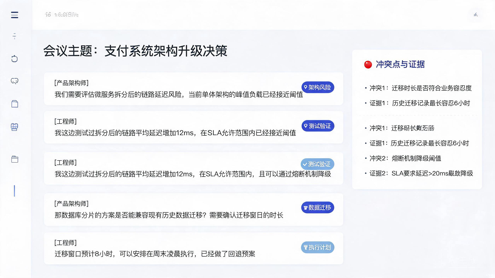
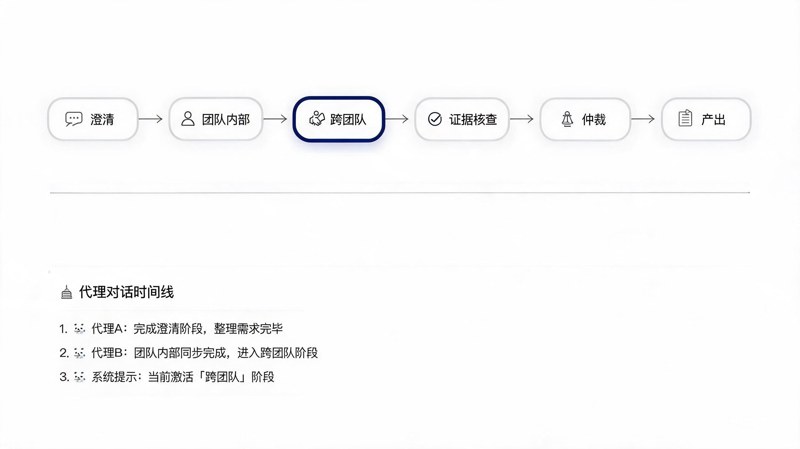
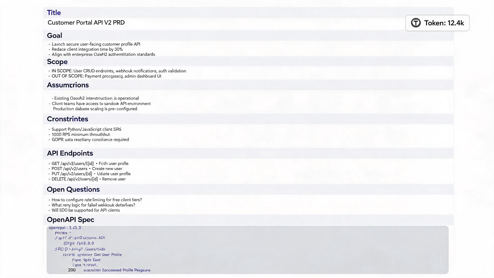
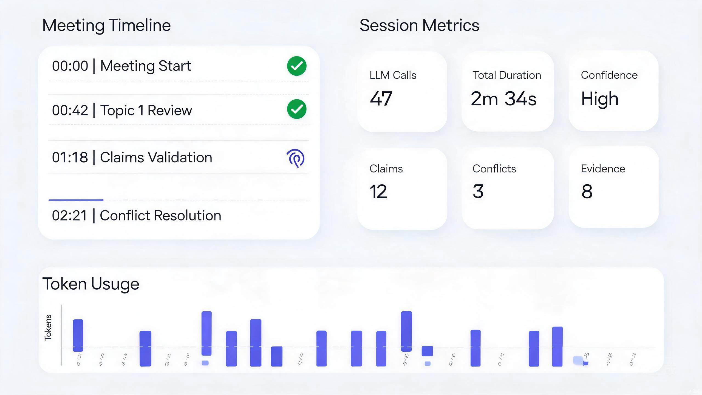

# Conclave

<div align="center">

[](LICENSE)
[](https://www.python.org/)
[](https://docs.docker.com/compose/)
[](https://fastapi.tiangolo.com/)
[](https://react.dev/)

**多智能体结构化决策系统** — 让 AI Agent 像开会一样产出高质量决策

*Multi-Agent Structured Decision-Making System. Run AI agents through a formal meeting pipeline: clarify, debate, evidence-check, arbitrate, and deliver.*

</div>

> Conclave（闭门会议）：一场有流程、有证据、有裁决、有落地交付的 AI 协作会议。每个 Agent 拥有独立视角与风险偏好，通过多角色结构化辩论消除单一大模型的盲区，保障产出质量与可靠性。

---

## 界面预览

<table>
  <tr>
    <td width="50%" align="center"><br><sub>多 Agent 结构化辩论</sub></td>
    <td width="50%" align="center"><br><sub>服务联通视图</sub></td>
  </tr>
  <tr>
    <td width="50%" align="center"><br><sub>PRD 与 OpenAPI 产出</sub></td>
    <td width="50%" align="center"><br><sub>实时日志与质量指标</sub></td>
  </tr>
</table>

---

## 与通用方案的差异

| 维度 | 单模型对话 | 通用 Agent 框架 | **Conclave** |
|---|---|---|---|
| 决策模式 | 单视角输出 | 角色分工但缺流程 | **六阶段会议管线**：澄清→辩论→证据→仲裁→交付 |
| 观点质量 | 受限于模型偏见 | 易产生群体思维 | **多角色对抗辩论**，强制暴露冲突点 |
| 证据诚实性 | 幻觉率高 | 可选工具调用 | **证据强制校验**：无证据时诚实降级置信度 |
| 产出物 | 文本回复 | 文本回复 | **可交付物**：PRD+OpenAPI、可部署服务、分析报告 |
| 可观测性 | 黑盒 | 基础日志 | **全链路追踪**：日志、Token/成本、漂移检查、审计 |
| 企业就绪 | 无 | 需自建 | **多租户 + RBAC + JWT 认证 + 审计日志** |
| 部署门槛 | SaaS 依赖 | 需自行编排 | **Docker Compose 一键启动**，全容器化 |

核心原则：不追求 Agent 数量多，而追求决策质量高。宁可诚实标注"证据不足"，也不编造伪引用。

---

## 核心特性

### 决策引擎
- **六阶段会议管线**：clarify（澄清）→ intra_team（队内立论）→ cross_team（跨队辩论）→ evidence_check（证据校验）→ arbitrate（仲裁裁决）→ produce（产出交付），带质量门禁与自动回流
- **7 种独立角色**：产品架构师、工程师、安全专家、UX 设计师、数据工程师、市场专家、主持人，每个角色有独立视角、风险偏好与证据偏好
- **动态借调机制**：主持人可根据议题复杂度动态申请补充专家角色
- **证据诚实性保障**：论点必须标注证据来源（文档/网页/常识/假设），无证据论点自动降级置信度
- **五层确定性保障**：参数约束、结论锁定、漂移检查、全链路追踪、自动降级兜底

### 执行与交付
- **Docker 沙箱隔离**：代码执行在独立容器中（Sibling Containers 架构），安全隔离
- **多主机分布式调度**：支持注册多台远程 Docker 主机（SSH/TCP+TLS/Unix Socket），内置 5 种调度策略（least_loaded/local_first/tag_match/manual/round_robin）
- **可部署服务交付**：会议结论可直接生成 FastAPI 后端 + React 前端 + Docker 配置，自动部署到沙箱运行
- **代码自动修复**：代码执行失败时自动分析错误并修复（RefineLoop，默认最多 5 轮）
- **Web 搜索能力**：Agent 可通过 Playwright 浏览器主动搜索资料支撑论点

### 企业级能力
- **多租户隔离**：租户级数据隔离（tenant_id 行级过滤）、配置覆盖、系统租户上下文
- **JWT 认证**：HttpOnly Cookie + CSRF 防护 + Token 刷新，支持默认管理员初始化
- **RBAC 权限控制**：基于角色的访问控制（插件化实现）
- **审计日志**：所有关键操作写入 PostgreSQL `audit_logs` 表，后台线程批量写入
- **成本追踪**：Token 消耗与费用实时统计，按会议/模型/角色维度聚合

### 可观测性
- **实时日志面板**：可折叠面板，实时显示后端所有节点执行日志，级别着色（ERROR/WARNING/INFO/DEBUG）
- **组件联通视图**：Topology 页面展示服务依赖关系、网络隔离层级、实时健康状态
- **Token 与成本监控**：实时统计 LLM 调用费用、Token 用量
- **结构化日志**：LogBus 统一日志总线，支持多 sink（文件、EventBus、控制台）
- **指标采集**：MetricsStore 环形缓冲区，前端可通过 API 读取

### RAG 检索增强
- **bge-m3 多语言 Embedding** + **bge-reranker-v2-m3 重排序**
- **HyDE 假设文档嵌入**：提升模糊查询召回率
- **Multi-Query 扩展**：自动生成多个查询变体
- **Qdrant 向量库**（推荐）/ 内存向量库（开发模式）
- **文档上传与分块**：支持会议关联参考文档

### 基础设施
- **实时通信**：WebSocket + 事件总线（内存缓存 + PostgreSQL 持久化 + Redis Pub/Sub 多副本广播 + 增量回放）
- **插件框架**：基于钩子（Hook）机制的事件驱动插件系统，支持热插拔
- **三层记忆**：Raw（原始发言）→ Feature（行为特征）→ Profile（稳定画像），画像反哺下次会议初始化
- **内存安全**：事件历史上限裁剪、前端日志上限、会议结束自动清理资源

---

## 文档导航

### 顶层文档

| 文档 | 面向读者 | 内容 |
|---|---|---|
| [README.md](README.md) | 所有人 | 项目概览、快速开始、核心特性（本文件） |
| [ARCHITECTURE.md](ARCHITECTURE.md) | 架构师/技术负责人 | 技术选型对比：每个维度选了什么、淘汰了什么、为什么 |
| [backend/README.md](backend/README.md) | 后端开发者 | 后端架构总览、子系统导航、开发指南 |
| [frontend/README.md](frontend/README.md) | 前端开发者 | 前端架构、页面/组件结构、开发指南 |
| [LICENSE](LICENSE) | 所有人 | MIT 开源协议 |

### 后端子系统文档

每个核心子系统有独立 README 详述设计与扩展方式：

| 子系统 | 文档 | 一句话说明 |
|---|---|---|
| 编排核心 | [orchestrator](backend/app/orchestrator/README.md) | 六阶段会议管线、上下文治理、质量门禁、ReactLoop/RefineLoop |
| Agent 计算层 | [agents](backend/app/agents/README.md) | LLM 调用封装、7 种角色定义、Prompt 管理、CallTrace 全链路追踪 |
| 检索增强 | [rag](backend/app/rag/README.md) | 混合检索（向量+关键词）、HyDE、Multi-Query、bge-m3 嵌入与重排序 |
| 插件框架 | [plugins](backend/app/plugins/README.md) | Hook 机制、三层分级（CORE/RUNTIME/OPTIONAL）、插件间通信 |
| 可观测性 | [observability](backend/app/observability/README.md) | LogBus 统一日志、CostTracker 成本追踪、MetricsStore、AuditLogger |
| 数据层 | [db](backend/app/db/README.md) | 异步 SQLAlchemy 引擎、ORM 模型、Redis、向量存储抽象 |
| 记忆系统 | [memory](backend/app/memory/README.md) | 三层记忆（Raw→Feature→Profile）、画像演化与反哺 |
| 工具与基础设施 | [tools](backend/app/tools/README.md) | Playwright Web 搜索、浏览器自动化、Docker 沙箱、事件总线 |

---

## 快速开始

### 环境要求

- Docker Desktop（Windows/macOS）或 Docker Engine + Docker Compose（Linux）
- 无需本地 Python/Node 环境（全部容器化）

### 一键启动

```bash
git clone https://github.com/QAQupupup/Conclave.git
cd Conclave
docker compose up -d --build
```

启动后访问：

| 服务 | 地址 |
|---|---|
| 前端界面 | http://localhost:5173 |
| 后端 API 文档 | http://localhost:8000/docs |
| PostgreSQL | localhost:5432（容器内） |
| Redis | localhost:6379（容器内） |
| Qdrant 向量库 | localhost:6333（容器内） |

### 配置 LLM（可选，不配置走 Stub 模式）

在项目根目录创建 `.env` 文件（或复制 `.env.example`）：

```env
# OpenAI 兼容接口（支持硅基流动、DeepSeek、通义千问等）
CONCLAVE_LLM_API_KEY=your-api-key
CONCLAVE_LLM_BASE_URL=https://api.siliconflow.cn/v1
CONCLAVE_LLM_MODEL=deepseek-ai/DeepSeek-V3.2
```

也可在前端"模型中心"页面直接配置。

### 使用流程

1. 打开 http://localhost:5173
2. 输入议题，选择产出物类型
3. 点击"开始会议"，观察六阶段自动执行
4. 会议完成后在"产出"面板查看结果

---

## 架构概览

```
┌──────────────────────────────────────────────────┐
│              Frontend (React + Custom CSS)        │
│  聊天面板 │ 日志面板 │ 联通图 │ 运维面板 │ 监控    │
└─────────────────────┬────────────────────────────┘
                      │ WebSocket / REST
┌─────────────────────┼────────────────────────────┐
│              Backend (FastAPI + asyncio)          │
│  ┌──────────────────┴──────────────────┐          │
│  │     EventBus 事件总线                │          │
│  │  内存缓存 + PG 持久化 + Redis Pub/Sub│          │
│  └──────────────────┬──────────────────┘          │
│  ┌──────────────────┴──────────────────┐          │
│  │   Runner/Manager 编排器              │          │
│  │  clarify → intra_team → cross_team  │          │
│  │  → evidence → arbitrate → produce   │          │
│  └────┬──────┬──────┬──────┬───────────┘          │
│  ┌────▼──┐┌──▼──┐┌──▼───┐┌──▼──┐                  │
│  │Agents ││ RAG ││Sand-││Tools│                  │
│  │(LLM)  ││     ││box   ││     │                  │
│  └───┬───┘└─────┘└──┬───┘└─────┘                  │
│      │              │ Docker API                   │
│      │         ┌────┴────┐                         │
│      │         ▼         ▼                         │
│      │   ┌──────────┐ ┌──────────┐                 │
│      │   │ 本地Docker│ │RemoteHost│                │
│      │   └──────────┘ └──────────┘                 │
│      ▼                                             │
│  ┌─────────────────────────────┐                   │
│  │ PostgreSQL │ Redis │ Qdrant │                   │
│  └─────────────────────────────┘                   │
└───────────────────────────────────────────────────┘
```

详细架构说明见 [backend/README.md](backend/README.md)。

---

## 技术栈

| 层 | 技术选型 |
|---|---|
| 后端 | Python 3.12 + FastAPI + asyncio + SQLAlchemy (async) |
| 前端 | React 18 + TypeScript + Vite（自定义 CSS 组件库） |
| 数据库 | PostgreSQL（主存储，含 pgvector）+ Redis（缓存/会话/Pub-Sub） |
| 向量检索 | Qdrant / 内存向量库（开发模式） |
| 嵌入模型 | bge-m3（多语言）+ bge-reranker-v2-m3（重排序） |
| 容器化 | Docker + Docker Compose（Sibling Containers 沙箱） |
| 实时通信 | WebSocket + 事件总线 + Redis Pub/Sub |
| 浏览器自动化 | Playwright + Chromium |
| 认证 | JWT + HttpOnly Cookie + CSRF（插件化） |

---

## API 概览

路由无全局 `/api` 前缀，完整列表见 `http://localhost:8000/docs`。

| 方法 | 路径 | 说明 |
|---|---|---|
| POST | `/meetings` | 创建会议 |
| GET | `/meetings` | 会议列表（按创建时间倒序） |
| GET | `/meetings/{id}` | 会议详情 |
| POST | `/meetings/{id}/run` | 启动会议（后台异步执行） |
| POST | `/meetings/{id}/control` | 控制（pause/resume/abort/inject） |
| POST | `/meetings/{id}/documents` | 上传参考文档 |
| DELETE | `/meetings/{id}` | 删除会议（清理关联资源） |
| WS | `/ws/meetings/{id}` | WebSocket 实时事件流 |
| GET/POST | `/docker-hosts` | Docker 主机管理 |
| POST | `/auth/login` | 登录 |
| POST | `/auth/logout` | 登出 |
| GET | `/auth/me` | 当前用户信息 |
| POST | `/auth/refresh` | 刷新 Token |
| GET | `/audit-logs` | 审计日志查询 |
| GET | `/metrics` | 运行指标快照 |

---

## 开发

### 本地开发

```bash
# 后端
cd backend
python -m venv .venv
.\.venv\Scripts\Activate.ps1   # Windows
pip install -e .
uvicorn app.main:app --reload

# 前端（另开终端）
cd frontend
npm install
npm run dev
```

注意：本地开发需自行启动 PostgreSQL、Redis、Qdrant。推荐使用 Docker Compose 启动基础设施。

详细开发指南见 [backend/README.md](backend/README.md) 和 [frontend/README.md](frontend/README.md)。

### 测试与质量检查

所有检查建议在 Docker 容器内执行（避免版本漂移）：

```bash
# 全量测试（含 ruff/mypy/pytest）
docker compose -f docker-compose.test.yml up --build --exit-code-from backend-test
```

### 贡献

欢迎提交 Issue 和 Pull Request。提交前请确保：
- 代码通过 lint 检查（ruff）
- 新增功能配有对应测试
- Commit Message 遵循 Conventional Commits

---

## License

[MIT License](LICENSE)
