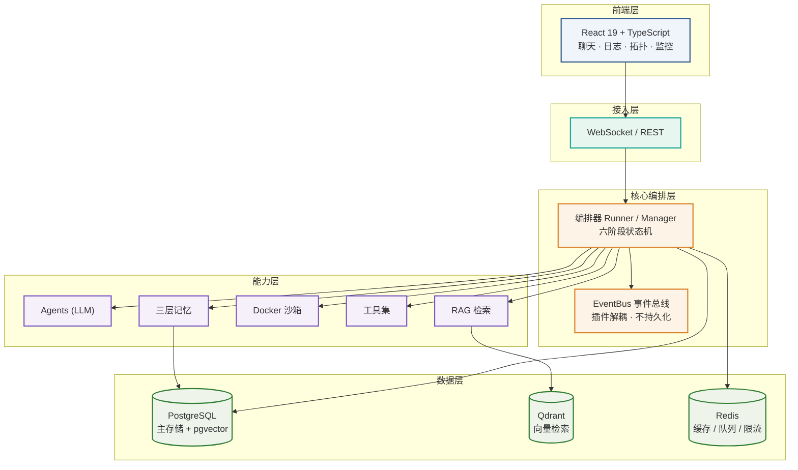
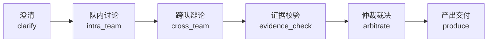

# ⚖️ Conclave

<p align="center">

**多智能体结构化决策引擎 · 让 AI 以"闭门会议"的方式完成高质量、可追溯的决策**

</p>

<p align="center">

**本仓库是 [Conclave-internal](https://github.com/QAQupupup/Conclave-internal)（私有仓库）的开源简化版（Community Edition）**

</p>

<p align="center">

[English](README.en.md) · 简体中文

</p>

<p align="center">

<a href="https://github.com/QAQupupup/Conclave/actions"></a>
<a href="https://github.com/QAQupupup/Conclave/blob/main/LICENSE"></a>
<a href="https://github.com/QAQupupup/Conclave/stargazers"></a>
<a href="https://github.com/QAQupupup/Conclave/issues"></a>
<a href="https://github.com/QAQupupup/Conclave/commits/main"></a>

</p>

> 以下徽章均可点击，跳转对应组件的官方仓库或官网。

<p align="center">

<a href="https://www.python.org/"></a>
<a href="https://fastapi.tiangolo.com/"></a>
<a href="https://www.postgresql.org/"></a>
<a href="https://github.com/pgvector/pgvector"></a>
<a href="https://redis.io/"></a>
<a href="https://qdrant.tech/"></a>
<a href="https://casbin.org/"></a>

</p>

<p align="center">

<a href="https://react.dev/"></a>
<a href="https://www.typescriptlang.org/"></a>
<a href="https://docs.docker.com/compose/"></a>
<a href="https://playwright.dev/"></a>

</p>

---

## 这是什么？

Conclave 不依赖单个模型一次性作答，而是组织一支 **AI Agent 团队**，把它当作一场正式的闭门会议：主持人清议题、多角色分边辩论、用证据校验每一条主张、仲裁裁决、最终交付可落地的产出。

整个过程**带流程、带证据、带裁决**，因此最终得到的是更可靠、且**推理可追溯**的决策，而不是单次生成的"黑盒答案"。

---

## 核心特性

| 能力 | 说明 |
|---|---|
| 🗂 **六阶段会议管线** | 澄清 → 队内讨论 → 跨队辩论 → 证据校验 → 仲裁 → 产出，带质量门禁与自动兜底 |
| 👥 **7 种内置角色** | 产品、工程、安全、UX、数据、市场、主持人，各有独立视角、风险偏好与证据偏好 |
| 🧩 **动态借调** | 主持人可按议题复杂度申请补充专家角色 |
| 🛡 **证据诚实** | 每条论点标注来源（文档 / 网页 / 常识 / 假设），无证据即诚实降级置信度，绝不编造引用 |
| 🎯 **五层确定性** | 参数约束、结论锁定、漂移检查、全链路追踪、自动降级兜底 |
| 🐳 **Docker 沙箱** | 代码在独立兄弟容器中安全执行，可部署到本地或远程主机 |
| 🌐 **Web 搜索** | Agent 通过 Playwright 主动检索资料支撑论点 |
| 🏢 **企业级** | 多租户隔离、JWT + HttpOnly Cookie 认证、Casbin RBAC、审计日志 |
| 📊 **可观测** | 实时日志面板、联通视图、Token 与成本监控、LLM 调用全链路追踪 |

---

## 架构总览


```mermaid
flowchart TB
    classDef fe      fill:#f0f4fb,stroke:#335c8e,stroke-width:2px
    classDef access  fill:#e7f6ef,stroke:#18a497,stroke-width:2px
    classDef core    fill:#fdf3e7,stroke:#d9822b,stroke-width:2px
    classDef cap     fill:#f6f0fb,stroke:#7a58c1,stroke-width:2px
    classDef store   fill:#eef4ea,stroke:#2e7d32,stroke-width:2px

    subgraph FE["前端层"]
        UI["React 19 + TypeScript<br/>聊天 · 日志 · 拓扑 · 监控"]
    end

    subgraph ACC["接入层"]
        WS["WebSocket / REST"]
    end

    subgraph ORC["核心编排层"]
        ORCH["编排器 Runner / Manager<br/>六阶段状态机"]
        BUS["EventBus 事件总线<br/>插件解耦 · 不持久化"]
    end

    subgraph CAP["能力层"]
        AG["Agents (LLM)"]
        RAG["RAG 检索"]
        SB["Docker 沙箱"]
        TL["工具集"]
        MEM["三层记忆"]
    end

    subgraph DAT["数据层"]
        PG[("PostgreSQL<br/>主存储 + pgvector")]
        QD[("Qdrant<br/>向量检索")]
        RD[("Redis<br/>缓存 / 队列 / 限流")]
    end

    UI --> WS
    WS --> ORCH
    ORCH --> BUS
    ORCH --> AG
    ORCH --> RAG
    ORCH --> SB
    ORCH --> TL
    ORCH --> MEM
    RAG --> QD
    MEM --> PG
    ORCH --> PG
    ORCH --> RD

    class UI fe
    class WS access
    class ORCH,BUS core
    class AG,RAG,SB,TL,MEM cap
    class PG,QD,RD store
```

> 名称 Conclave（闭门会议）：一场有流程、有证据、有裁决、有落地交付的 AI 协作会议。

## 六阶段决策流程


```mermaid
flowchart LR
    A[澄清<br/>clarify] --> B[队内讨论<br/>intra_team]
    B --> C[跨队辩论<br/>cross_team]
    C --> D[证据校验<br/>evidence_check]
    D --> E[仲裁裁决<br/>arbitrate]
    E --> F[产出交付<br/>produce]
```

每个阶段有独立质量门禁：结果未达标会触发自动回退或兜底，而不是静默失败。

---

## Built With · 技术栈

> 徽章墙提供"一眼辨识"，下面的图表给出了每项技术的分工。logo 均可点击跳转官方地址。

<p align="center">
<table align="center">
<tr>
  <td align="center" width="130"><a href="https://www.python.org/"><br/><b>Python 3.12</b></a><br/>后端运行时</td>
  <td align="center" width="130"><a href="https://fastapi.tiangolo.com/"><br/><b>FastAPI</b></a><br/>异步 Web 框架</td>
  <td align="center" width="130"><a href="https://www.sqlalchemy.org/"><br/><b>SQLAlchemy 2</b></a><br/>异步 ORM</td>
  <td align="center" width="130"><a href="https://platform.openai.com/"><b>OpenAI SDK</b></a><br/>LLM 接入</td>
  <td align="center" width="130"><a href="https://react.dev/"><br/><b>React 19</b></a><br/>前端 UI</td>
</tr>
<tr>
  <td align="center" width="130"><a href="https://www.typescriptlang.org/"><br/><b>TypeScript</b></a><br/>类型安全</td>
  <td align="center" width="130"><a href="https://vitejs.dev/"><br/><b>Vite</b></a><br/>前端构建</td>
  <td align="center" width="130"><a href="https://tailwindcss.com/"><br/><b>Tailwind CSS</b></a><br/>原子化样式</td>
  <td align="center" width="130"><a href="https://www.postgresql.org/"><br/><b>PostgreSQL</b></a><br/>主存储 + pgvector</td>
  <td align="center" width="130"><a href="https://redis.io/"><br/><b>Redis</b></a><br/>缓存 / 队列</td>
</tr>
<tr>
  <td align="center" width="130"><a href="https://www.docker.com/"><br/><b>Docker</b></a><br/>容器化 & 沙箱</td>
  <td align="center" width="130"><a href="https://github.com/features/actions"><br/><b>GitHub Actions</b></a><br/>CI 流水线</td>
  <td align="center" width="130"><a href="https://playwright.dev/"><br/><b>Playwright</b></a><br/>浏览器检索 / 值守</td>
  <td align="center" width="130"><a href="https://casbin.org/"><b>Casbin</b></a><br/>RBAC 权限</td>
  <td align="center" width="130"><a href="https://qdrant.tech/"><b>Qdrant</b></a><br/>向量检索</td>
</tr>
</table>
</p>

### 分层明细

| 层 | 技术 | 在这个项目里的作用 | 官方链接 |
|---|---|---|---|
| **运行时** | Python 3.12 · Uvicorn · Pydantic | asyncio 原生异步后端 | [python.org](https://www.python.org/) |
| **Web 框架** | FastAPI · SQLAlchemy 2 (async) · Alembic | REST / WebSocket、异步 ORM、迁移 | [fastapi](https://fastapi.tiangolo.com/) · [sqlalchemy](https://www.sqlalchemy.org/) |
| **AI 推理** | OpenAI SDK（兼容硅基流动 / DeepSeek / 通义千问） | 统一 LLM 接入，可插拔 | [openai](https://platform.openai.com/) |
| **检索 / RAG** | bge-m3 向量化 · Qdrant · jieba · Playwright · httpx · BeautifulSoup | 证据检索、中文分词、Web 信息采集 | [qdrant](https://qdrant.tech/) · [playwright](https://playwright.dev/) |
| **数据存储** | PostgreSQL 16 + pgvector · Redis | 主存储 + 向量检索、缓存与任务队列 | [postgresql](https://www.postgresql.org/) · [redis](https://redis.io/) |
| **认证与权限** | JWT + HttpOnly Cookie · CSRF · Casbin (RBAC) · cryptography | 登录态、租户隔离、细粒度权限、密钥加密 | [casbin](https://casbin.org/) |
| **前端** | React 19 · TypeScript · Vite · Tailwind CSS v4 · Radix UI · Zustand · TanStack Query | 聊天、日志、拓扑、监控界面 | [react](https://react.dev/) · [vite](https://vitejs.dev/) |
| **基础设施** | Docker Compose · Nginx · GitHub Actions · noVNC | 一键部署、反向代理、CI/CD、远程值守 | [docker](https://www.docker.com/) · [github actions](https://github.com/features/actions) |

---

## 快速开始

### 环境要求

- Docker Desktop（Windows / macOS）或 Docker Engine + Docker Compose（Linux）
- 无需本地 Python / Node 环境（全部容器化）

### 一键启动

```bash
git clone https://github.com/QAQupupup/Conclave.git
cd Conclave
docker compose up -d --build
```

<details>
<summary>服务地址一览</summary>

| 服务 | 地址 |
|---|---|
| 前端界面 | http://localhost:5174 |
| 后端 API 文档 | http://localhost:8001/docs |
| PostgreSQL | localhost:5433 |
| Redis | localhost:6380 |
| Qdrant 向量库 | localhost:6335 |

</details>

### 配置 LLM（可选，不配置走 Stub 演示模式）

在项目根目录创建 `.env`（或复制 `.env.example`）：

```env
# OpenAI 兼容接口（支持硅基流动、DeepSeek、通义千问等）
CONCLAVE_LLM_API_KEY=your-api-key
CONCLAVE_LLM_BASE_URL=https://api.siliconflow.cn/v1
CONCLAVE_LLM_MODEL=deepseek-ai/DeepSeek-V3.2
```

### 使用

1. 打开 http://localhost:5174
2. 输入议题，选择产出物类型（PRD / 研究报告 / 商业报告 / 设计文档 / 可部署服务 / 数据分析）
3. 点击「开始会议」，观察六阶段自动执行
4. 结束后在「产出」面板查看结果

---

## 文档

| 文档 | 说明 |
|---|---|
| [快速上手](doc-public/GETTING_STARTED.md) | 面向新手的完整上手指引 |
| [功能特性](doc-public/FEATURES.md) | 各模块特性详解 |
| [部署指南](doc-public/DEPLOYMENT.md) | 生产部署与配置说明 |
| [常见问题](doc-public/FAQ.md) | 高频问题排查 |
| [架构](ARCHITECTURE.md) | 技术选型对比与设计取舍 |

---

## 路线图

- 统一物料与产物仓库
- 服务持久化与恢复
- 前端生成与挂载流水线固化
- gRPC Agent Worker 横向扩展

---

## 开源与使用

本仓库是 [Conclave-internal](https://github.com/QAQupupup/Conclave-internal)（私有仓库）的**开源简化版（Community Edition）**，以 **AGPL v3** 协议发布，用于演示、学习与二次开发。六阶段决策管线、7 种内置角色、RAG 证据检索等核心能力均在此开源；完整版的全部决策算法与高级能力保留在私有仓库中。

受 AGPL 保护，任何基于本仓库公开部分的衍生作品须以相同协议开源。

## 贡献与支持

- 反馈与建议：通过 [Issue](https://github.com/QAQupupup/Conclave/issues) 提交
- 参与开发：请先阅读 [CONTRIBUTING.md](.github/CONTRIBUTING.md)

## License

[GNU Affero General Public License v3.0](LICENSE)