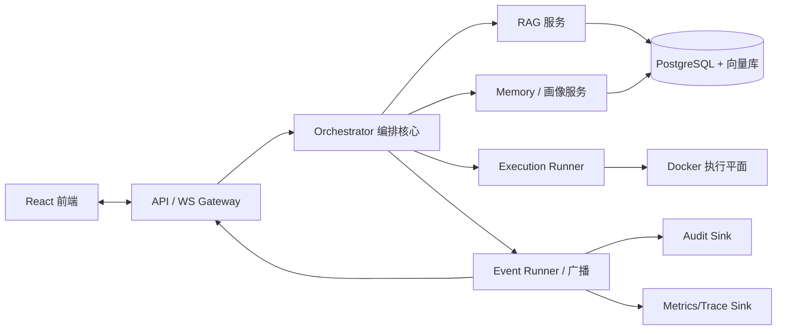

# Conclave 理想设计稿（终态架构）

> 本文档记录 Conclave 的**终态架构愿景**，即系统完全演化后的目标形态。
> 它是设计上限，不是第一阶段实现清单。落地推导见 [`mvp-plan.md`](./mvp-plan.md)，约束原则见 [`design-principles.md`](./design-principles.md)。
>
> 来源说明：本稿以早期架构探讨中提出的完整设想为基础，经工程化重构而成。早期讨论曾使用代号 *Zore*，本文统一以 **Conclave** 指代本系统。

---

## 1. 系统定位

Conclave 不是一个“会说话的角色集合”，而是一个**可演化的会议型智能体系统**。它把一次议题拆解为多智能体结构化辩论、证据支撑裁决、产物（PRD / 接口规范 / 可验证代码骨架）输出的完整闭环，并在迭代中沉淀智能体行为特征。

终态系统具备三个判定特征：

1. **结构化知识系统**——检索不靠全文 embedding top-k，而靠保真原文、保真结构、概念抽取、按需激活的知识图。
2. **事件驱动协作**——实时性不绑死 WebSocket，而由事件广播 runner 统一负责状态变更与消息分发。
3. **可迭代的个体**——智能体发言全量留底，选择性提炼为长期行为特征与稳定画像，反哺下一次会议初始化。

---

## 2. 总体架构



逻辑上分为八个边界，物理上首期可同进程部署，但边界先画清楚：

| 边界 | 职责 | 语言策略 |
|---|---|---|
| API / WS Gateway | 对外入口、鉴权、请求路由 | 后期可换 Go/Rust |
| Orchestrator | 会议状态机、角色编排、裁决调度 | Python（变化最快，不宜过早换语言） |
| RAG 服务 | 文档入库、知识图、检索、重排 | Python，性能热点可抽服务 |
| Memory / 画像 | 发言留底、特征提炼、稳定画像 | Python |
| Event Runner | 事件标准化、去重、fan-out、replay | 后期网关可换 Go/Rust |
| Execution Runner | 代码生成挂载、容器调度、lint/test 回传 | 后期可换更强系统语言 |
| Persistence | 会议、消息、证据、产物持久化 | PostgreSQL + 向量库 |
| Frontend | 四块布局、实时流、拓扑图 | TypeScript（独立边界） |

进程边界早抽的好处：换语言时不伤业务编排核心。原则见 §9。

---

## 3. 知识与检索（结构化 RAG）

### 3.1 设计目标

传统“文档切碎 → 全量 embedding → top-k 检索”在会议型系统里会暴露四类问题：噪声积累、概念歧义、上下文断裂、成本失控。Conclave 的终态 RAG 取向是：

> 原文保真、结构保真、概念抽取、按需激活的知识图式 RAG。

### 3.2 五个概念的工程化定义

| 抽象说法 | 工程化定义 |
|---|---|
| 切块 | chunk 单元带结构边界、语义边界、来源偏移 |
| 链表结构 | 不是线性链表，而是 **chunk graph / document graph** |
| 提炼 | 对 chunk 抽取摘要、论点、定义、实体 |
| 术语化 | 构建术语表、别名表、概念归一表 |
| 惰性 | 惰性解析、惰性 embedding、惰性重排、惰性上下文扩展 |

### 3.3 Chunk Graph 数据模型

真实文档关系不止 `prev/next`，还含 `parent/child`、`defines/defined_by`、`references/referenced_by`、`same_term_as`、`contradicts`、`supports`、`cites`、`belongs_to_section`。首期不上重型图数据库，用四张轻量表承载：

**chunk_nodes**
- id, doc_id, chunk_type, text, summary
- terms[], entities[]
- char_start, char_end
- embedding_status, sparse_index_status

**chunk_edges**
- from_chunk_id, to_chunk_id, edge_type, weight

**term_dict**
- canonical_term, aliases[], definition, source_chunk_ids[]

**document_outline**
- doc_id, section_id, parent_section_id, title, order_index

这四张表即可支撑顺序邻接、概念跳转、章节回溯、术语统一、惰性上下文扩展。

### 3.4 提炼：每 chunk 四类衍生信息

| 衍生物 | 用途 |
|---|---|
| short_summary | 快速预览 |
| claims | 论点级检索 |
| definitions | 术语与定义 |
| actionable_items | 执行相关指令/规则抽取 |

不同角色取不同类型：架构师看 constraints/interfaces，产品看 goals/assumptions，安全看 risk/policies，仲裁者看 claims/evidence。

### 3.5 术语归一层（Terminology Normalizer）

会议型系统最怕“不同 agent 用不同词说同一件事”与“同一词跨文档含义不同”。术语归一层至少覆盖：同义词归一、缩写展开、中英混用映射、项目专有名词登记、版本差异标注。

示例：

- “会中控场” = “moderation control”
- “借调” = “expert loan / temporary assignment”
- “裁决者” = “arbiter”
- “议题覆盖率” ≠ “裁定正确率”

### 3.6 四层惰性

不做惰性，系统会在 embedding、rerank、上下文拼接三处成本爆炸。

- **惰性解析**：文档入库只做基础抽取、章节骨架、元数据；详细提炼按需触发。
- **惰性 embedding**：高频区先 embedding，被命中 chunk 再补全，热门文档优先深加工。
- **惰性重排**：候选集足够大且任务重要时才 rerank。
- **惰性上下文扩展**：先取命中 chunk，需要时再沿 edge 扩展上下文窗口。

分层思想与混合检索“先召回候选，再融合/重排”一致，成本不打满。

### 3.7 RAG 入库流水线

| 阶段 | 产出 |
|---|---|
| A 原始入库 | 原文、文档类型、来源、hash、版本、解析状态 |
| B 结构解析 | section tree、chunk nodes、chunk edges、code block 边界、term candidates |
| C 轻提炼 | short summary、claims、definitions、entities、keywords |
| D 按需深加工 | embedding、rerank features、concept linking、contradiction hints（仅高热度触发） |
| E 检索与验证 | metadata filter → dense/sparse recall → fusion → rerank → context expansion → source grounding |

该流水线天然支持惰性：D 阶段只在命中热度高时触发。

---

## 4. 事件广播架构（Event Runner）

### 4.1 核心判断

WebSocket 只是一个出口，不是核心。应用层不应直接维护连接列表做广播——FastAPI 官方文档已明确：内存连接列表只适合单进程，生产化广播需外部能力（Redis / PostgreSQL 等）。架构上必须预留 MQ / Event Bus。

### 4.2 三层分离

**应用层只产出事件**：meeting.created、meeting.stage.changed、agent.spoke、evidence.attached、artifact.generated、execution.log.appended、decision.finalized。

**Event Runner 统一处理**：事件标准化、去重、排序、节流、fan-out、replay、trace 注入。

**出口层多 sink 分发**：WebSocket Gateway、Audit Sink、Metrics Sink、Trace Sink、Notification Sink。后接 Redis / NATS / RabbitMQ / Kafka 都不伤主业务。

### 4.3 协议抽象

```python
class EventBus(Protocol):
    async def publish(self, event: DomainEvent) -> None: ...
    async def subscribe(self, topic: str) -> AsyncIterator[DomainEvent]: ...

class BroadcastRunner(Protocol):
    async def dispatch(self, event: DomainEvent) -> None: ...
```

- 首期实现：`InMemoryEventBus` + `LocalBroadcastRunner`
- 后期实现：`RedisEventBus` / `NatsEventBus` / `WsGatewayRunner`

协议边界先定清，后续迁语言或换中间件都不伤筋动骨。

---

## 5. 借调三问法（Borrow Justification Contract）

多 Agent 编排里“router / subagent / handoff”的权衡核心是：**不是角色越细越好，而要在控制、成本、上下文隔离之间平衡。** 借调专家须走正式申请。

### 5.1 三问

1. **借调目标是什么**——当前缺失的是知识、视角、执行能力，还是裁决能力？
2. **借调是否必要**——现有 agent/team 是否已具备近似能力？是否只是“想更细”而非“真缺关键能力”？
3. **不借调的代价是什么**——结论失真 / 风险遗漏 / 证据不足 / 执行不可落地 / 仅质量略降？

### 5.2 裁决结果

- `reject`——驳回
- `defer`——暂缓
- `approve_temporary`——临时批准
- `approve_frozen_scope`——冻结范围批准

这等同于真实组织里的“专家借调申请单”，避免无意义细分岗位。

---

## 6. 智能体记忆与个体演化

### 6.1 为什么要保留发言记录

发言记录不是聊天历史，而是**可监督的行为数据**，至少支撑六项用途：复盘结论形成、裁决解释、行为诊断、人格提炼、质量评估、产品优化（调 prompt / 路由 / 借调规则 / 裁决阈值）。

### 6.2 三层记忆

逐层收敛，**全量保留原始记录，选择性提炼长期特征**。直接把全部发言当长期记忆会造成噪声积累、错误固化、人格漂移、token 成本失控。

**原始发言层（不可变日志）**
- 原始文本、发言时间、发言阶段、被谁回复、引用证据、是否被采纳、是否被纠正
- 用途：回放、调试、标注、行为分析、训练提炼器

**行为特征层**
- 偏保守/激进、先谈风险/先谈收益、结构化/发散、重证据/重经验
- 易被反驳的观点类型、压力下沟通风格变化
- 用途：这是优化 persona 的核心数据

**稳定画像层（少量高价值配置项）**
- default_stance_style、ambiguity_tolerance、evidence_dependency_level
- collaboration_preference、escalation_threshold
- 用途：真正反哺系统，初始化下次会议的 agent

### 6.3 个体唯一性的建立维度

**首期不要把“人格”做成戏剧化人设，要做成“决策偏置参数”。** 没有真实履历时堆过多设定容易伪装过度、表演化。

| 层级 | 首期是否需要 | 说明 |
|---|---|---|
| Role 专业角色 | 必须 | 核心视角来源 |
| Style 沟通风格 | 必须 | 影响表达方式 |
| Evidence Preference | 必须 | 决定引用偏好 |
| Risk Appetite | 建议 | 决定激进/保守 |
| Full Biography | 不建议过深 | 无资料时易伪装过度 |
| MBTI 全量模拟 | 后期 | 易表演化 |

---

## 7. 会议状态机与控制信号

终态阶段流（七阶段，详细契约见 §8 数据模型与各阶段 I/O）：


控场信号贯穿全程：`pause` / `resume` / `inject` / `abort` / `freeze` / `loan`。每个阶段有明确的输入输出契约。

> 注：MVP 阶段将合并简化为六阶段（不含独立 Verify），见 `mvp-plan.md`。

---

## 8. 核心数据模型

| 模型 | 关键字段 |
|---|---|
| Meeting | id, topic, state, current_stage, team_ids, created_at |
| Team | id, meeting_id, role_set, scope |
| AgentInstance | id, role_template_id, persona_profile_id, team_id |
| RoleTemplate | id, role, style, evidence_preference, risk_appetite |
| Message | id, agent_id, stage, text, evidence_refs, adopted, corrected_by |
| Evidence | id, chunk_id, quote, char_range, confidence |
| Artifact | id, meeting_id, type(prd/api_spec/code), schema_id, payload |
| ExecutionJob | id, artifact_id, level(L1/L2/L3), status, logs |
| MemoryRecord | id, agent_id, layer(raw/feature/profile), content, ts |
| BorrowRequest | id, requester, target_role, justification, verdict |

---

## 9. 语言演进策略

原则：**先用 Python 把“正确性”和“产品结构”做出来，再把“性能热点”和“稳定性热点”服务化、异构化。**

Python 在原型期有三大优势：熟悉、AI/RAG/编排生态成熟、原型速度快。

| 模块 | 是否后续换语言 | 原因 |
|---|---|---|
| 核心业务编排 | 暂不建议 | 变化最快，Python 便于迭代 |
| 高并发事件网关 | 可以 | Go/Rust 更适合高并发连接 |
| 执行平面 | 可以 | 容器调度、日志转发适合更强系统语言 |
| 检索服务 | 可以 | 高性能查询服务适合单独抽服务 |
| 前端 | 不变 | 本就是独立 TS 边界 |

### 9.1 把未来换语言成本降到最低的三原则

1. **业务协议先稳定**——MeetingState、AgentMessage、EvidenceRef、DecisionRecord、ArtifactMeta、ExecutionJob、DomainEvent 的 schema 提前稳定。边界清，换语言不伤筋动骨。
2. **进程边界早抽**——逻辑上至少分 API/Gateway、Orchestrator、RAG Service、Execution Runner、Event Runner；物理上可先放一起。
3. **先换热点不换大脑**——上 Go/Rust 先换 WS Gateway、Event Bus Consumer、Execution Log Streamer，不先换编排核心。

---

## 10. 感知层与工具端口（终态愿景，接口先行）

终态 Conclave 的 agent 不只是"推理引擎"，还能主动从环境获取信息。这些能力不是角色，而是**工具**——agent 在需要时调用的外部能力。介入点明确：clarify 阶段补充议题背景、evidence_check 阶段补充外部证据、produce 阶段验证产物可行性。

### 10.1 三类感知能力

| 类别 | 具体能力 | 本质 | 集成成本 |
|---|---|---|---|
| 结构化检索 | Web Search API、平台 API（GitHub/npm/PyPI） | 调接口拿 JSON，确定性高 | 低 |
| 非结构化抓取 | 浏览器自动化、网页读取 | 模拟人类浏览，提取内容 | 中高 |
| 环境感知 | 鼠标/键盘/摄像头/系统事件 | 桌面级交互，实时流 | 高，超出会议系统范畴 |

首期只做第一类（结构化检索），后两类终态愿景预留接口。

### 10.2 工具端口协议

所有感知能力走统一接口，编排核心不感知具体实现：

```python
class ToolPort(Protocol):
    """工具端口：agent 可调用的外部感知能力"""
    name: str
    evidence_type: str        # "web" | "platform_api" | "browser" | "desktop"

    async def search(self, query: str, top_k: int = 5) -> list[Evidence]:
        """检索并返回证据列表，结果标注来源类型"""
        ...
```

返回的 `Evidence` 带有 `source_type` 字段（`[doc:section]` / `[web:url]` / `[api:platform]` / `[common_knowledge]`），和文档证据一起进入仲裁流程。工具的不可靠性被仲裁层过滤，不直接进结论链。

### 10.3 介入点

| 阶段 | 触发条件 | 工具 | 效果 |
|---|---|---|---|
| Clarify | 议题涉及外部依赖 | Web Search | 补充议题背景注入上下文 |
| EvidenceCheck | RAG 证据不足 | Web Search / Platform API | 补充外部证据 |
| Produce | 生成 OpenAPI | npm registry / PyPI API | 验证依赖包真实存在 |

### 10.4 首期实现边界

- Web Search：支持四种模式（stub / tavily / playwright / remote），当前以 Playwright 无头浏览器爬取 Bing + 正文提取为主模式，亦可独立部署为 RemoteWebSearch 服务
- 结果标注 `[web:source]`，和 `[doc:section]` 一起走仲裁
- 浏览器自动化与桌面感知：接口定义好，实现推迟

### 10.5 设计原则

工具调用的结果**不直接进结论链**，而是作为"证据"注入 evidence_check，和 RAG 证据一起走仲裁。这样工具的不可靠性被仲裁层过滤，不会污染最终决策。

---

## 11. 本文与其它文档的关系

- 终态愿景的落地约束与“现在该做/暂缓/不做”分级，见 [`architecture-review.md`](./architecture-review.md)。
- RAG 五原则、广播 runner 原则等固化条款，见 [`design-principles.md`](./design-principles.md)。
- 第一阶段可执行版本，见 [`mvp-plan.md`](./mvp-plan.md)。
