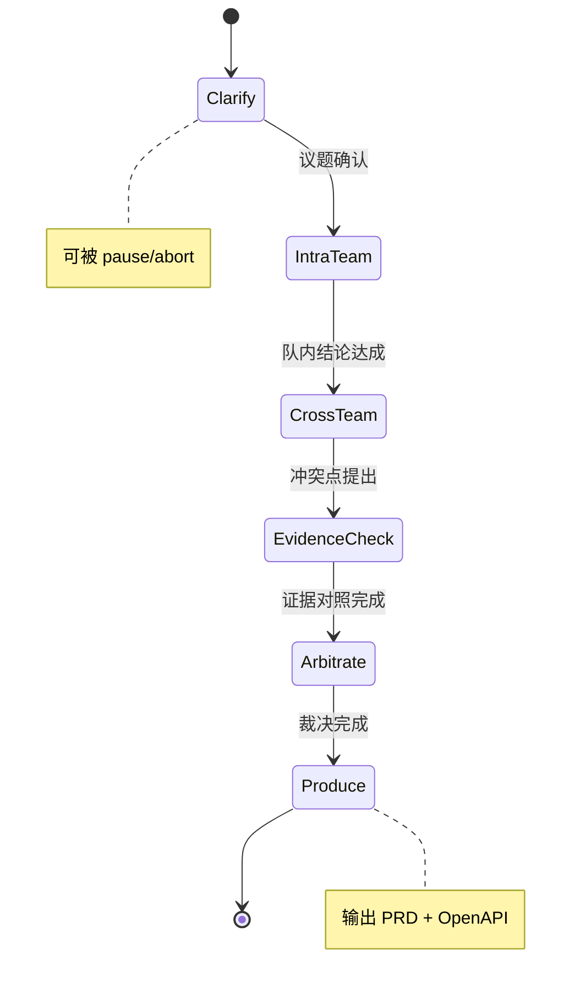

# Conclave 迭代一详细设计

> 本文是 [`mvp-plan.md`](./mvp-plan.md) 的工程细化：状态机节点、角色 Prompt、Pydantic 模型、WebSocket 事件、前端布局、项目目录树。
> 直接对应两周计划的 Day 1-7（核心链路）。代码骨架落地依据本文件。

---

## 1. 状态机

### 1.1 六阶段总览



### 1.2 节点定义

每个节点有统一契约：`async def run(state: MeetingState) -> MeetingState`，纯函数风格，副作用通过事件广播外溢。

| 阶段 | 节点函数 | 输入 | 输出 | 职责 |
|---|---|---|---|---|
| Clarify | `clarify_node` | topic, uploaded_docs | clarified_topic, team_config, key_questions | 主持人澄清议题，确认团队组成 |
| IntraTeam | `intra_team_node` | clarified_topic, team_config | team_conclusions[] | 各角色队内发言，达成队内结论 |
| CrossTeam | `cross_team_node` | team_conclusions[] | conflicts[] | 跨队辩论，暴露冲突点 |
| EvidenceCheck | `evidence_check_node` | conflicts[], rag_index | evidence_set{conflict_id, evidence[], stance} | RAG 检索证据，逐冲突对照 |
| Arbitrate | `arbitrate_node` | evidence_set, conflicts | decision_record, adopted_claims[] | 仲裁者裁决，形成结论 |
| Produce | `produce_node` | decision_record | artifact{prd, openapi_spec} | 生成结构化 PRD 与 OpenAPI 片段 |

### 1.3 控制信号

信号经 WebSocket 注入，由 Orchestrator 拦截处理，不污染状态机纯函数语义。

| 信号 | 语义 | 处理 |
|---|---|---|
| `pause` | 暂停当前阶段 | 保存快照，阻塞下一节点 |
| `resume` | 恢复 | 从快照恢复，继续 |
| `abort` | 终止会议 | 标记 `state.status=aborted`，进入归档 |
| `inject` | 主持人注入消息 | 追加到 `state.injected_messages`，下一轮可见 |
| `loan` | 借调专家 | 触发借调三问表单，裁决后才加入 |

### 1.4 状态对象

```python
from enum import Enum
from pydantic import BaseModel, Field
from typing import Optional

class Stage(str, Enum):
    CLARIFY = "clarify"
    INTRA_TEAM = "intra_team"
    CROSS_TEAM = "cross_team"
    EVIDENCE_CHECK = "evidence_check"
    ARBITRATE = "arbitrate"
    PRODUCE = "produce"

class MeetingStatus(str, Enum):
    RUNNING = "running"
    PAUSED = "paused"
    ABORTED = "aborted"
    DONE = "done"

class MeetingState(BaseModel):
    meeting_id: str
    topic: str
    stage: Stage = Stage.CLARIFY
    status: MeetingStatus = MeetingStatus.RUNNING
    clarified_topic: Optional[str] = None
    team_config: list[dict] = Field(default_factory=list)     # [{role, stance}]
    messages: list[dict] = Field(default_factory=list)         # 发言记录
    injected_messages: list[dict] = Field(default_factory=list)
    conflicts: list[dict] = Field(default_factory=list)
    evidence_set: list[dict] = Field(default_factory=list)
    decision_record: Optional[dict] = None
    artifact: Optional[dict] = None
    paused_snapshot: Optional[dict] = None
```

---

## 2. 角色 Prompt 模板

设计原则：角色 = 专业视角 + 决策偏置参数，不做戏剧化人设（见 [`design-principles.md`](./design-principles.md) 原则 5）。

### 2.1 主持人（Moderator / 仲裁合一）

```
[系统] 你是 Conclave 会议主持人。职责是推进流程、澄清议题、识别冲突、维持规则。
风格：简洁、结构化、不臆断。

[阶段: Clarify]
输入议题：{topic}
上传资料摘要：{doc_summaries}
任务：
1. 用一句话复述议题，确认无歧义
2. 列出 3-5 个待澄清的关键问题
3. 建议团队组成（角色 + 立场）

输出 JSON: {clarified_topic, key_questions[], team_config[]}
```

### 2.2 产品/架构师（Product-Architect）

```
[系统] 你是产品架构师。关注目标、用户价值、系统边界、接口约束。
决策偏置：先谈价值与约束，再谈实现；重证据引用；适度保守。

[阶段: IntraTeam]
议题：{clarified_topic}
你的立场：{stance}
任务：从产品与架构视角给出论点，每条论点须标注证据来源 [doc:section] 或标注 [assumption]。

输出: 3-5 条结构化论点 {claim, evidence_ref, type(fact|assumption|constraint)}
```

### 2.3 工程师（Engineer，含 QA 视角）

```
[系统] 你是工程师，兼负 QA 视角。关注可行性、实现风险、测试边界。
决策偏置：先质疑可行性，再谈方案；重执行细节。

[阶段: IntraTeam]
议题：{clarified_topic}
你的立场：{stance}
任务：从工程可行性角度给出论点，标注风险等级与证据来源。

输出: 3-5 条结构化论点 {claim, evidence_ref, risk_level, type}
```

### 2.4 跨队辩论阶段（通用）

```
[阶段: CrossTeam]
各方队内结论：{team_conclusions}
任务：找出结论间的冲突点。冲突类型分为 factual（事实矛盾）、preference（取舍分歧）、scope（边界争议）。

输出: conflicts[] {id, type, summary, side_a, side_b}
```

### 2.5 证据对照阶段

```
[阶段: EvidenceCheck]
冲突点：{conflict}
检索证据：{evidence_chunks}  (来自 RAG, 含 [doc:section] 引用)
任务：逐条证据判断支持哪一方，或中立，或与冲突无关。

输出: {conflict_id, evidence_assessments[{quote, source, supports}]}
```

### 2.6 仲裁 + 产出阶段

```
[阶段: Arbitrate]
冲突与证据：{evidence_set}
任务：基于证据裁决每个冲突，给出采纳结论与驳回理由。

输出 JSON: {decisions[{conflict_id, verdict, rationale}], adopted_claims[]}

[阶段: Produce]
裁决结果：{decision_record}
任务：产出结构化 PRD 与 OpenAPI 片段。严格遵守给定 schema。

输出 JSON:
{
  "prd": {
    "title", "goal", "scope", "assumptions[], "constraints[]",
    "api_endpoints[]", "open_questions[]"
  },
  "openapi": "<OpenAPI 3.0 YAML 片段>"
}
```

---

## 3. 核心 Pydantic 模型

```python
# app/models.py
from pydantic import BaseModel, Field
from datetime import datetime
from enum import Enum
from typing import Optional

class Role(str, Enum):
    MODERATOR = "moderator"
    PRODUCT_ARCHITECT = "product_architect"
    ENGINEER = "engineer"

class ClaimType(str, Enum):
    FACT = "fact"
    ASSUMPTION = "assumption"
    CONSTRAINT = "constraint"

class ConflictType(str, Enum):
    FACTUAL = "factual"
    PREFERENCE = "preference"
    SCOPE = "scope"

class Message(BaseModel):
    id: str
    meeting_id: str
    agent_role: Role
    stage: str
    content: str
    claim_refs: list[str] = Field(default_factory=list)
    evidence_refs: list[str] = Field(default_factory=list)
    created_at: datetime

class Claim(BaseModel):
    id: str
    agent_role: Role
    text: str
    claim_type: ClaimType
    evidence_ref: Optional[str] = None
    risk_level: Optional[str] = None

class Conflict(BaseModel):
    id: str
    conflict_type: ConflictType
    summary: str
    side_a: str
    side_b: str

class Evidence(BaseModel):
    id: str
    chunk_id: str
    quote: str
    source: str               # doc:section
    char_range: tuple[int, int]

class EvidenceAssessment(BaseModel):
    conflict_id: str
    evidence_id: str
    supports: str              # "a" | "b" | "neutral" | "irrelevant"

class Decision(BaseModel):
    conflict_id: str
    verdict: str               # "a" | "b" | "compromise"
    rationale: str

class DecisionRecord(BaseModel):
    decisions: list[Decision]
    adopted_claims: list[str]

class EvidenceSet(BaseModel):
    conflict_id: str
    assessments: list[EvidenceAssessment]

class PRD(BaseModel):
    title: str
    goal: str
    scope: str
    assumptions: list[str]
    constraints: list[str]
    api_endpoints: list[str]
    open_questions: list[str]

class Artifact(BaseModel):
    meeting_id: str
    prd: PRD
    openapi: str

class Meeting(BaseModel):
    id: str
    topic: str
    status: str
    stage: str
    created_at: datetime
    messages: list[Message] = Field(default_factory=list)
    artifact: Optional[Artifact] = None

class BorrowRequest(BaseModel):
    id: str
    requester: Role
    target_role: str
    goal: str
    necessary: str
    no_loan_cost: str
    verdict: Optional[str] = None    # reject|defer|approve_temporary|approve_frozen_scope
```

---

## 4. WebSocket 事件

首期内存广播，协议先按终态薄接口设计（见 [`ideal-design.md`](./ideal-design.md) §4），后续换 MQ 不改 schema。

### 4.1 事件类型

| event | 方向 | payload | 触发时机 |
|---|---|---|---|
| `meeting.created` | S→C | `{meeting_id, topic}` | 会议创建 |
| `stage.changed` | S→C | `{meeting_id, from, to}` | 阶段切换 |
| `agent.spoke` | S→C | `{meeting_id, role, stage, content, claim_refs[]}` | agent 发言 |
| `evidence.attached` | S→C | `{meeting_id, conflict_id, quote, source}` | 证据注入 |
| `artifact.generated` | S→C | `{meeting_id, prd, openapi}` | 产出完成 |
| `loan.requested` | S→C | `{meeting_id, request}` | 借调申请提交 |
| `loan.resolved` | S→C | `{meeting_id, request_id, verdict}` | 借调裁决 |
| `control.signal` | C→S | `{meeting_id, signal, payload?}` | 主持人控场 |
| `error` | S→C | `{meeting_id, code, message}` | 异常 |

### 4.2 事件对象

```python
# app/events.py
from pydantic import BaseModel
from datetime import datetime
from typing import Any, Literal

class DomainEvent(BaseModel):
    type: str
    meeting_id: str
    payload: dict[str, Any]
    ts: datetime
    trace_id: str | None = None

# 内存实现，后期换 RedisEventBus 不改上层
class InMemoryEventBus:
    def __init__(self):
        self._subs: dict[str, list] = {}

    async def publish(self, event: DomainEvent) -> None: ...
    async def subscribe(self, topic: str): ...
```

### 4.3 WS 端点

```
WS /ws/meetings/{meeting_id}
  - 连接时回放当前 state 快照
  - 后续推送 DomainEvent
  - 接收 control.signal 转发 Orchestrator
```

---

## 5. 前端页面草稿

四块布局，单页应用（React + TypeScript）。

```
┌─────────────────────────────────────────────────┐
│ Header: Meeting 标题 | 阶段指示器 | 控场按钮      │
├──────────────────┬──────────────────────────────┤
│ 左:聊天流        │ 右上:议题 / 澄清结论          │
│ agent 发言卡片   ├──────────────────────────────┤
│ 按角色着色       │ 右中:冲突与证据面板           │
│ [doc:section]    │ conflict → evidence → verdict │
│ 可点击溯源       ├──────────────────────────────┤
│                  │ 右下:产物预览(PRD/OpenAPI)   │
│                  │ + 借调表单入口               │
└──────────────────┴──────────────────────────────┘
```

### 5.1 组件树

```text
<App>
  <Header>                        // 会议标题、阶段进度条、pause/resume/abort
  <ChatPanel>                     // 左侧聊天流
    <MessageCard role color />    // 单条发言，证据 ref 可点击高亮右侧面板
  <RightPanel>
    <TopicPanel />                // 议题 + 澄清结论 + key_questions
    <EvidencePanel />             // 冲突列表 → 选中展开证据与裁决
    <ArtifactPanel />             // PRD 预览 + OpenAPI 代码块
  <BorrowDialog />                // 借调三问表单（模态）
```

### 5.2 状态流

`useWebSocket(meeting_id)` 钩子单向接收 `DomainEvent`，按 `type` 分发到对应 reducer：
- `agent.spoke` → append message
- `stage.changed` → update stage
- `evidence.attached` → upsert evidence by conflict_id
- `artifact.generated` → set artifact

控场按钮 `onClick` → `ws.send({type:'control.signal', signal})`。

---

> **历史注记** (2026-07-14): 以下目录树反映迭代一初期状态。当前结构见 README.md。主要变化：`nodes.py` 已拆分为 `nodes/` 包，`db.py` 已拆分为 `db/` 包，`tools/` 已扩展为包含 `playwright/` 子包和 `engines/` 子目录。

## 附录 A：项目目录树（迭代一初期）

```
├── .gitignore
├── docs/
│   ├── ideal-design.md
│   ├── design-principles.md
│   ├── mvp-plan.md
│   ├── architecture-review.md
│   └── iteration-1-design.md
├── backend/
│   ├── pyproject.toml
│   ├── app/
│   │   ├── main.py                 # FastAPI 入口 + WS 路由
│   │   ├── config.py               # 配置（LLM key、向量库地址）
│   │   ├── models.py               # Pydantic 模型（见 §3）
│   │   ├── events.py               # DomainEvent + InMemoryEventBus
│   │   ├── db.py                   # SQLite + SQLModel（现已拆分为 db/ 包）
│   │   ├── orchestrator/
│   │   │   ├── state.py            # 状态机 + 控制信号
│   │   │   ├── nodes.py            # 六阶段节点（现已拆分为 nodes/ 包）
│   │   │   └── runner.py           # 编排运行器
│   │   ├── agents/
│   │   │   ├── llm.py              # LLM 调用封装
│   │   │   ├── prompts.py          # 角色 Prompt 模板（见 §2）
│   │   │   └── roles.py            # 角色实例化
│   │   ├── rag/
│   │   │   ├── chunker.py          # Markdown 切块
│   │   │   ├── store.py            # 向量库读写
│   │   │   └── retriever.py        # 检索 + 重排
│   │   └── routers/
│   │       ├── meetings.py         # 会议 CRUD
│   │       ├── documents.py        # 文档上传
│   │       └── ws.py               # WebSocket 端点
│   └── tests/
│       └── test_smoke.py
└── frontend/
    ├── package.json
    ├── src/
    │   ├── App.tsx
    │   ├── hooks/
    │   │   └── useWebSocket.ts
    │   ├── components/
    │   │   ├── Header.tsx
    │   │   ├── ChatPanel.tsx
    │   │   ├── MessageCard.tsx
    │   │   ├── TopicPanel.tsx
    │   │   ├── EvidencePanel.tsx
    │   │   ├── ArtifactPanel.tsx
    │   │   └── BorrowDialog.tsx
    │   ├── store/
    │   │   └── meetingReducer.ts
    │   └── types/
    │       └── events.ts           # 镜像后端事件 schema
    └── vite.config.ts
```

### 6.1 各目录职责

- `backend/app/orchestrator/`——状态机核心，变化最快，不换语言
- `backend/app/agents/`——LLM 调用与 Prompt，单独隔离便于迭代调优
- `backend/app/rag/`——检索子系统，后期可抽独立服务
- `backend/app/routers/`——HTTP + WS 入口，边界清晰
- `frontend/src/store/`——事件驱动的状态管理，与后端事件 schema 对齐

---

## 7. 一次完整会议的 demo flow

1. 用户提交议题 + 上传 Markdown 资料
2. `clarify_node`：主持人 LLM 澄清议题，WS 推 `stage.changed` + `agent.spoke`
3. `intra_team_node`：产品架构师、工程师各自队内发言，WS 流式推 `agent.spoke`
4. `cross_team_node`：暴露冲突，WS 推 `agent.spoke`（含 conflicts）
5. `evidence_check_node`：逐冲突 RAG 检索，WS 推 `evidence.attached`
6. `arbitrate_node`：仲裁裁决，WS 推 `agent.spoke`（含 decisions）
7. `produce_node`：生成 PRD + OpenAPI，WS 推 `artifact.generated`
8. 前端实时渲染全过程，右侧面板逐步填充

> 控场：用户可随时点 pause/resume/abort；借调点 BorrowDialog 提交三问表单。

---

## 8. 与其它文档的关系

- 状态机与角色受 [`design-principles.md`](./design-principles.md) 原则 5（个体即决策偏置）约束
- RAG 实现是 [`ideal-design.md`](./ideal-design.md) §3 的极简版（无 graph、无术语归一）
- WebSocket 事件是 [`ideal-design.md`](./ideal-design.md) §4 Event Runner 的内存薄接口版
- 两周排期对应 [`mvp-plan.md`](./mvp-plan.md) §5 的 Day 1-7 与 Day 8-14
