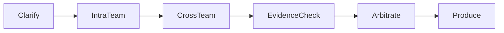

# Conclave MVP 可执行计划（v1）

> 本文档是第一阶段落地版：用极简内核先验证全部核心链路，2 周内跑通一次完整会议。
> 它是终态愿景的“降维可开工版”，取舍依据见 [`design-principles.md`](./design-principles.md)，风险评估见 [`architecture-review.md`](./architecture-review.md)。
>
> 说明：早期方案中提到的完整 Docker 执行闭环，经评审存在 sandbox、调度、超时、依赖污染等高风险，列入“可选/后置”。本文默认先跑通**会议—裁决—产物**主闭环，Docker 验证作为加分项条件性引入（见 §6）。

---

## 1. 核心原则

- **主闭环唯一**：议题 → 多 Agent 结构化辩论 → 证据支撑裁决 → 产出 PRD / 接口规范（可选触发代码骨架生成与验证）。
- **极简但可演进**：高级抽象（事件总线、图 RAG、人格演化）只做最薄接口，后续填充。
- **一切为了验证**：第 1 周末跑通第一次完整会议，第 2 周末产出可演示 Demo。

---

## 2. v1 技术边界

| 必须实现（v1） | 预留接口但不实现 | 完全不碰 |
|---|---|---|
| 单会议、单用户、单仲裁者 | 多租户 namespace | SaaS 权限 |
| 固定 5 角色：仲裁者、主持人、产品/架构师、工程师、QA | 15 角色库、动态组队 | 复杂角色体系 |
| 工作记忆（上下文窗口）+ SQLite 留底消息 | 压缩摘要、长期向量记忆、三层记忆 | 人格演化 |
| 极简 RAG：Markdown → 切块 → 向量检索 → 重排 | 多索引、术语归一、惰性管道 | Chunk Graph |
| 借调手动触发 + 主持人填三问表单、冻结团队人工操作 | 自动借调策略 | 智能合约 |
| 代码生成可触发（产物 + lint/test，见 §6 风险控制） | L3 网络限制、Runner 抽象 | K8s |
| 前端：四块布局 + 聊天流，无拓扑图 | 力导向图组件 | 复杂可视化 |
| 内存 WebSocket 广播，会议流推送 | 事件总线、MQ | Event Sourcing |
| 裁决输出：Pydantic Schema 生成结构化 PRD 与 OpenAPI 片段 | 完整代码工程生成 | 全自动商用系统 |

> 关于角色数量：经评审，5 角色对单人 2 周开发仍偏重。若资源紧，可进一步收敛为 3 角色（产品/架构师合并、工程师合并 QA、仲裁者），以“跑通协作”为第一目标。见 [`architecture-review.md`](./architecture-review.md) §4。

---

## 3. v1 最简架构

```text
┌─────────────┐     ┌──────────────────┐
│  React UI   │ ←→  │ FastAPI + WS     │
│ (四块布局)  │     │ (会议管理、实时推) │
└─────────────┘     └───────┬──────────┘
                            │
        ┌───────────────────┼───────────────────┐
        │                   │                   │
  ┌─────v─────┐   ┌────────v───────┐   ┌───────v──────┐
  │ LLM 引擎   │   │  RAG 服务       │   │ 代码生成/执行 │
  │ (状态机)   │   │ (向量检索+重排)  │   │ (可选,见§6)   │
  └───────────┘   └────────────────┘   └──────────────┘
            │               │
            └───────┬───────┘
                    │
            ┌───────v───────┐
            │  SQLite 持久化 │
            │ (会议、消息)   │
            └───────────────┘
```

- **LLM 引擎**：用简化状态机（六阶段）替代终态七阶段；主持人与控场信号（pause / resume / abort）经 WebSocket 注入。
- **RAG 服务**：文档上传即按 Markdown 标题切块，生成 embedding 存向量库，检索时向量召回 + 重排，证据原文返回。
- **代码生成/执行**：从 PRD 接口定义生成 FastAPI/Flask 骨架，可选放入容器跑 lint + test，收集输出反馈裁决（条件性引入）。

---

## 4. 状态机（六阶段）

终态七阶段在 v1 合并为六阶段（不含独立 Verify）：



| 阶段 | 输入 | 输出 |
|---|---|---|
| Clarify | 议题、上传资料 | 议题澄清结论、团队组建 |
| IntraTeam | 议题、角色 | 各角色队内发言 |
| CrossTeam | 队内结论 | 跨队辩论、冲突点 |
| EvidenceCheck | 冲突点、RAG 证据 | 证据对照、采纳/驳回 |
| Arbitrate | 证据、辩论 | 裁决记录、结构化结论 |
| Produce | 裁决结论 | PRD / OpenAPI 片段（可选代码骨架） |

---

## 5. 两周开发计划

**第 1 周：核心链路**
- Day 1-2：搭项目骨架，FastAPI + SQLite 模型，状态机空跑。
- Day 3-4：实现角色 LLM 交互（prompt 模板），完成队内讨论与跨队辩论。
- Day 5：集成向量库，实现文档上传、切分、检索，在讨论中注入证据。
- Day 6：仲裁者汇总产出结构化 PRD（Pydantic 约束 + function calling）。
- Day 7：联调，跑通第一次完整会议。

**第 2 周：工程加固 + 执行闭环**
- Day 8-9：前端基础版（四块布局），WebSocket 实时推送。
- Day 10-11：控场指令（abort / pause / resume）与手动借调表单。
- Day 12-13：代码生成触发接口 + 可选容器验证（lint/test），失败回传。
- Day 14：整体调试、修 bug、基础测试、录制 Demo。

**产出物**：可演示系统——输入议题 → 看 Agent 辩论并引用证据 → 得到 PRD → 可选获得通过基本验证的 API 代码。

> 若单人开发且时间紧，第 2 周的 Docker 验证可整体后置，Demo 以“议题→辩论→PRD”为闭环。

---

## 6. 代码生成/执行的风险控制（条件性引入）

Docker 执行在真实工程里是高风险模块（sandbox 安全、容器调度、超时、失败回传、依赖污染），非 MVP 核心路径。若要在 v1 引入，须满足：

- 仅 L1 只读 / L2 写文件两个级别，不开放网络。
- 固定超时、固定资源上限、用完即删容器。
- 失败输出结构化回传仲裁者，不阻塞主流程。
- 生成代码限定为 FastAPI/Flask 骨架 + 单文件 lint/test。

达不到以上约束则后置到 v2，v1 仅产出代码骨架不执行。

---

## 7. 演进路线

- **v2**：引入三层记忆、动态角色库、力导向图视图、事件总线抽象。
- **v3**：Chunk Graph、术语归一、自动借调策略、多租户、完整执行风险分级。

终态目标见 [`ideal-design.md`](./ideal-design.md)。
